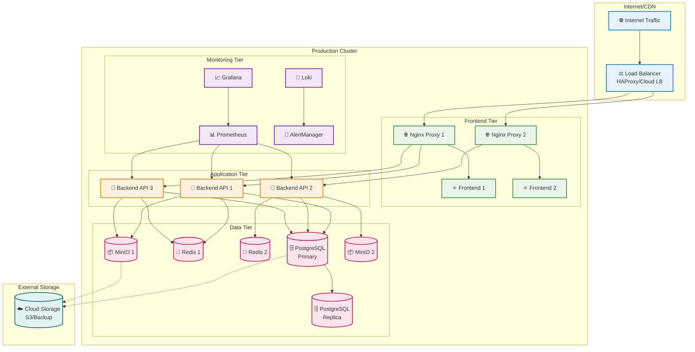
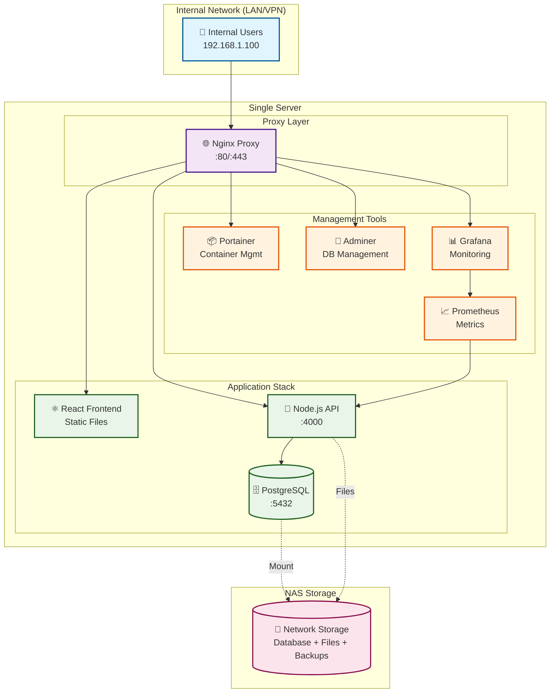
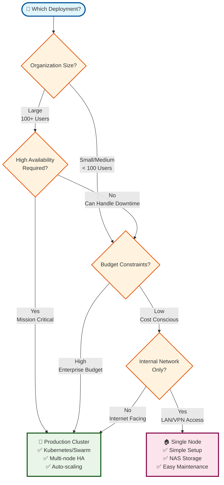

# PRS Production Deployment

Production deployment configuration and setup guide for PRS (Purchase Requisition System)

## Deployment Options

This repository provides **three deployment options** to meet different infrastructure and development needs:

### 🏢 Production Cluster Deployment
**For enterprise environments with high availability requirements**

- **Path**: `/` (root directory)
- **Technology**: Docker Swarm or Kubernetes
- **Architecture**: Multi-node cluster with load balancing
- **Features**: High availability, auto-scaling, enterprise monitoring
- **Use Case**: Large organizations, critical production systems

[📖 **Production Setup Guide**](./PRODUCTION-SETUP.md) | [🚀 **Deployment Guide**](./DEPLOYMENT-GUIDE.md)

### 🏠 On-Premises Single Node
**For small to medium organizations with simpler requirements**

- **Path**: `/onprem-single-node/`
- **Technology**: Docker containers (no orchestration)
- **Architecture**: Single server with NAS storage
- **Features**: Simplified management, cost-effective, easy maintenance
- **Use Case**: Small teams, departmental deployments, budget-conscious setups

[📖 **Single Node Setup Guide**](./onprem-single-node/SETUP-GUIDE.md) | [📁 **Configuration Files**](./onprem-single-node/)

### 💻 Local MacBook Development
**For local development and testing on macOS**

- **Path**: `/local-macbook-setup/`
- **Technology**: Docker Desktop for Mac
- **Architecture**: Local containers with Docker volumes
- **Features**: No root privileges, alternative ports, development-optimized
- **Use Case**: Local development, testing, learning, demos

[📖 **MacBook Setup Guide**](./local-macbook-setup/SETUP-GUIDE.md) | [📁 **Configuration Files**](./local-macbook-setup/) | [🔄 **Comparison**](./local-macbook-setup/COMPARISON.md)

## Quick Start

### For Production Clusters

```bash
# Clone repository
git clone https://github.com/rcdelacruz/prs-production-deployment.git
cd prs-production-deployment

# Set up secrets and SSL
./scripts/setup-secrets.sh --all your-domain.com

# Deploy production stack
./scripts/deploy-production.sh --deploy --init-db
```

### For Single Node On-Premises

```bash
# Clone repository
git clone https://github.com/rcdelacruz/prs-production-deployment.git
cd prs-production-deployment/onprem-single-node

# Configure environment
cp .env.example .env
nano .env  # Edit for your environment

# Deploy single node
./scripts/deploy.sh
```

### For Local MacBook Development

```bash
# Clone repository
git clone https://github.com/rcdelacruz/prs-production-deployment.git
cd prs-production-deployment/local-macbook-setup

# Configure environment (optional)
cp .env.example .env

# Deploy locally (uses ports 8080/8443)
./scripts/deploy-local.sh

# Access at https://localhost:8443
```

## Architecture Overview

### Production Cluster Architecture



### Single Node Architecture



## Deployment Decision Matrix



## Feature Comparison

| Feature | Production Cluster | Single Node |
|---------|-------------------|-------------|
| **Deployment Complexity** | High | Low |
| **Infrastructure Cost** | High | Low |
| **High Availability** | ✅ Multi-node failover | ❌ Single point of failure |
| **Scalability** | ✅ Horizontal scaling | ⚠️ Vertical scaling only |
| **Load Balancing** | ✅ Built-in | ❌ Not applicable |
| **Auto-scaling** | ✅ Based on metrics | ❌ Manual scaling |
| **Storage** | ✅ Distributed/Cloud | ✅ NAS/Local |
| **Monitoring** | ✅ Enterprise-grade | ✅ Basic dashboards |
| **Backup** | ✅ Automated + Cloud | ✅ Automated + NAS |
| **SSL/Security** | ✅ Enterprise | ✅ Standard |
| **Container Management** | ✅ Kubernetes/Swarm | ✅ Portainer |
| **Database Management** | ✅ Clustered | ✅ Single instance |
| **Setup Time** | 2-4 hours | 30-60 minutes |
| **Maintenance** | Medium complexity | Low complexity |

## Service Access

### Production Cluster
- **Main App**: https://your-domain.com
- **API**: https://api.your-domain.com
- **Monitoring**: https://monitoring.your-domain.com
- **Admin Tools**: Integrated in monitoring dashboard

### Single Node
- **Main App**: https://your-server/
- **API**: https://your-server/api/
- **Portainer**: https://your-server/portainer/
- **Adminer**: https://your-server/adminer/
- **Grafana**: https://your-server/grafana/

### Local MacBook Development
- **Main App**: https://localhost:8443/
- **API**: https://localhost:8443/api/
- **Portainer**: https://localhost:8443/portainer/
- **Adminer**: https://localhost:8443/adminer/
- **Grafana**: https://localhost:8443/grafana/

## Directory Structure

```
prs-production-deployment/
├── README.md                    # This file
├── PRODUCTION-SETUP.md         # Production cluster guide
├── DEPLOYMENT-GUIDE.md         # Detailed deployment instructions
├── LICENSE                     # MIT license
│
├── compose/                    # Production Docker Compose files
├── k8s/                       # Kubernetes manifests
├── nginx/                     # Production Nginx configs
├── monitoring/                # Enterprise monitoring stack
├── scripts/                   # Production deployment scripts
├── examples/                  # Production config examples
│
├── onprem-single-node/        # 🏠 SINGLE NODE SETUP
│   ├── README.md              # Single node overview
│   ├── SETUP-GUIDE.md         # Complete setup guide
│   ├── docker-compose.yml     # Simple container setup
│   ├── .env.example          # Configuration template
│   ├── nginx/                # Proxy configuration
│   ├── scripts/              # Deployment scripts
│   └── config/               # Service configurations
│
└── local-macbook-setup/       # 💻 LOCAL DEVELOPMENT SETUP
    ├── README.md              # MacBook setup overview
    ├── SETUP-GUIDE.md         # Complete setup guide
    ├── COMPARISON.md          # vs Production comparison
    ├── docker-compose.yml     # Local container setup
    ├── .env.example          # Local configuration template
    ├── nginx/                # Local proxy configuration
    ├── scripts/              # Local deployment scripts
    └── config/               # Local service configurations
```

## Requirements

### Production Cluster
- **Nodes**: 3+ servers (HA)
- **CPU**: 4+ cores per node
- **RAM**: 16+ GB per node
- **Storage**: SSD + distributed storage
- **Network**: Load balancer + DNS
- **Skills**: DevOps/SysAdmin experience

### Single Node
- **Server**: 1 server
- **CPU**: 4+ cores
- **RAM**: 8+ GB (16+ recommended)
- **Storage**: SSD + NAS
- **Network**: Basic networking
- **Skills**: Basic Linux administration

### Local MacBook Development
- **Machine**: MacBook (M1/M2/M3 or Intel)
- **CPU**: 2+ cores
- **RAM**: 8+ GB (16+ recommended)
- **Storage**: 20+ GB free space
- **Software**: Docker Desktop for Mac
- **Skills**: Basic command line usage

## Security Features

Both deployments include:
- ✅ SSL/TLS encryption
- ✅ Security headers and rate limiting
- ✅ Container isolation
- ✅ Encrypted backups
- ✅ Access logging and monitoring
- ✅ Regular security updates

**Production adds:**
- ✅ Network segmentation
- ✅ Secrets management (Docker secrets/K8s secrets)
- ✅ Advanced firewall rules
- ✅ Enterprise monitoring and alerting

**Single Node includes:**
- ✅ Basic authentication for admin tools
- ✅ Self-signed or commercial SSL certificates
- ✅ Container-level security
- ✅ NAS-based backup encryption

## Monitoring and Management

### Production Cluster
- **Prometheus + Grafana**: Enterprise monitoring
- **AlertManager**: Advanced alerting
- **Loki**: Centralized logging
- **Kubernetes Dashboard / Portainer**: Container management

### Single Node
- **Grafana**: Basic monitoring dashboards
- **Portainer**: Container management UI
- **Adminer**: Database management
- **Prometheus**: Metrics collection

## Backup Strategy

### Production Cluster
- **Database**: Automated daily backups with replication
- **Files**: Distributed storage with redundancy
- **Configs**: Version-controlled infrastructure
- **Storage**: Cloud storage (S3) + local retention
- **Recovery**: Multi-region disaster recovery

### Single Node
- **Database**: Daily PostgreSQL dumps
- **Files**: File system backups to NAS
- **Configs**: Local configuration backup
- **Storage**: NAS storage + optional cloud sync
- **Recovery**: Local backup restoration

## Support and Documentation

📖 **Comprehensive Guides:**
- [Production Setup Guide](./PRODUCTION-SETUP.md) - Complete production deployment
- [Deployment Guide](./DEPLOYMENT-GUIDE.md) - Step-by-step instructions
- [Single Node Guide](./onprem-single-node/SETUP-GUIDE.md) - On-premises setup

🔧 **Configuration Examples:**
- [Production Examples](./examples/) - Enterprise configuration templates
- [Single Node Examples](./onprem-single-node/.env.example) - Simple configuration

🐛 **Troubleshooting:**
- Check individual setup guides for troubleshooting sections
- Review container logs: `docker logs <container-name>`
- Health checks included in deployment scripts

## Migration Path

**From Single Node to Production Cluster:**
1. Export application data and database
2. Set up production cluster environment
3. Import data to production cluster
4. Update DNS to point to new cluster
5. Decommission single node

**From Production Cluster to Single Node:**
1. Export application data and database
2. Set up single node environment
3. Import data to single node
4. Update configurations for single node
5. Redirect traffic to single node

## Contributing

Contributions are welcome! Please:

1. Fork the repository
2. Create a feature branch (`git checkout -b feature/improvement`)
3. Commit your changes (`git commit -am 'Add improvement'`)
4. Push to the branch (`git push origin feature/improvement`)
5. Create a Pull Request

## License

MIT License - see [LICENSE](./LICENSE) file for details.

## Support

For issues and questions:

1. **Check Documentation**: Review the appropriate setup guide
2. **Search Issues**: Look through existing GitHub issues
3. **Create Issue**: Submit a new issue with details
4. **Community**: Engage with other users and contributors

---

**Choose your deployment option and get started with PRS today!** 🚀
