# On-Premises Single Node Setup (LAN/VPN Access Only)

This directory contains a simplified deployment configuration for **internal network deployment** - accessible only via LAN or VPN connections, not exposed to the public internet.

## Architecture

```mermaid
graph TB
    subgraph "Internal Network (LAN/VPN)"
        Users[👥 Internal Users<br/>LAN/VPN Access]
    end
    
    subgraph "Single Server (192.168.1.100)"
        subgraph "Nginx Proxy :80/443"
            Nginx[🌐 Nginx<br/>SSL Termination<br/>Reverse Proxy]
        end
        
        subgraph "Application Services"
            Frontend[⚛️ React Frontend<br/>Static Files]
            Backend[🚀 Node.js API<br/>Business Logic]
            Postgres[🗄️ PostgreSQL<br/>Database]
        end
        
        subgraph "Management Tools"
            Portainer[📦 Portainer<br/>Container Mgmt]
            Adminer[🔧 Adminer<br/>DB Management]
            Grafana[📊 Grafana<br/>Monitoring]
            Prometheus[📈 Prometheus<br/>Metrics]
        end
    end
    
    subgraph "NAS Storage"
        NAS[(💾 Network Storage<br/>Database + Files + Backups)]
    end
    
    Users --> Nginx
    Nginx --> Frontend
    Nginx --> Backend
    Nginx --> Portainer
    Nginx --> Adminer
    Nginx --> Grafana
    
    Backend --> Postgres
    Grafana --> Prometheus
    Prometheus --> Backend
    Prometheus --> Postgres
    
    Postgres -.-> NAS
    Backend -.-> NAS
    
    classDef userClass fill:#e1f5fe,stroke:#01579b,stroke-width:2px
    classDef serverClass fill:#f3e5f5,stroke:#4a148c,stroke-width:2px
    classDef appClass fill:#e8f5e8,stroke:#1b5e20,stroke-width:2px
    classDef mgmtClass fill:#fff3e0,stroke:#e65100,stroke-width:2px
    classDef storageClass fill:#fce4ec,stroke:#880e4f,stroke-width:2px
    
    class Users userClass
    class Nginx serverClass
    class Frontend,Backend,Postgres appClass
    class Portainer,Adminer,Grafana,Prometheus mgmtClass
    class NAS storageClass
```



## Network Flow


## Network Access

**⚠️ Important: Internal Network Only**
- This setup is designed for **LAN/VPN access only**
- **Not exposed to public internet**
- Access via internal IP addresses (e.g., `192.168.1.100`, `10.0.0.50`)
- Users connect via corporate network or VPN

## Features

- **Single Node**: Simple Docker containers without orchestration
- **Internal Access**: LAN/VPN only - no public internet exposure
- **Simplified Stack**: No MinIO, no Redis, no clustering
- **NAS Storage**: Database, files, and backups stored on NAS
- **Internal Proxy**: All services accessible through single internal IP
- **Container Management**: Portainer for easy container management
- **Database Management**: Adminer for PostgreSQL administration
- **Basic Monitoring**: Grafana dashboards for internal monitoring

## Quick Start

1. **Prepare the server**:
   ```bash
   git clone https://github.com/rcdelacruz/prs-production-deployment.git
   cd prs-production-deployment/onprem-single-node
   ```

2. **Validate setup**:
   ```bash
   # Check prerequisites and configuration
   ./scripts/validate-setup.sh
   ```

3. **Configure environment**:
   ```bash
   cp .env.example .env
   nano .env  # Edit for your internal network
   ```

4. **Deploy**:
   ```bash
   ./scripts/deploy.sh
   ```

5. **Access services** (via LAN/VPN):
   - **Application**: https://192.168.1.100 (your server IP)
   - **Portainer**: https://192.168.1.100/portainer
   - **Adminer**: https://192.168.1.100/adminer  
   - **Grafana**: https://192.168.1.100/grafana

## Network Requirements

### Internal Network Access
- **Server**: Static IP on internal network (e.g., `192.168.1.100`)
- **Users**: Access via LAN or VPN connection
- **NAS**: Accessible on same network or VLAN
- **DNS**: Optional internal DNS entry (e.g., `prs.company.local`)

### No Internet Exposure
- **Ports**: 80/443 only accessible from internal network
- **Firewall**: Block external access to server
- **SSL**: Self-signed certificates (no public CA validation needed)
- **Security**: Focus on internal threat model

## Service URLs (Internal Access)

All services accessible through internal IP or hostname:

- `https://192.168.1.100/` - Main application
- `https://192.168.1.100/api/` - Backend API
- `https://192.168.1.100/portainer/` - Container management
- `https://192.168.1.100/adminer/` - Database management
- `https://192.168.1.100/grafana/` - Monitoring dashboards

Or with internal DNS:
- `https://prs.company.local/`
- `https://prs.company.local/portainer/`
- `https://prs.company.local/adminer/`
- `https://prs.company.local/grafana/`

## Requirements

### Hardware
- **CPU**: 4+ cores
- **RAM**: 8+ GB (16+ recommended)
- **Storage**: SSD for OS + NAS for data
- **Network**: Gigabit LAN connection

### Network Infrastructure
- **Internal Network**: 192.168.x.x or 10.x.x.x network
- **NAS**: Network-accessible storage (NFS/SMB)
- **DNS**: Optional internal DNS server
- **VPN**: For remote access (if needed)

### Access Requirements
- **LAN Users**: Direct network access
- **Remote Users**: VPN connection to corporate network
- **Admin Access**: Network administrator credentials
- **No Public Access**: Server not exposed to internet

## Security Model

**Internal Network Security:**
- Self-signed SSL certificates (no public CA needed)
- Basic authentication for admin tools
- Container isolation and networking
- Regular security updates via internal network
- Backup encryption for data protection

**Threat Model:**
- Focuses on internal network security
- Assumes trusted internal network environment  
- Protection against unauthorized internal access
- Data protection and backup security

## Directory Structure

```
onprem-single-node/
├── docker-compose.yml          # Container configuration for LAN deployment
├── .env.example               # Internal network configuration template
├── nginx/                     # Internal proxy configuration
├── scripts/                   # Internal deployment scripts
├── config/                    # Service configurations
└── README.md                  # This file (LAN/VPN setup)
```

## Storage Configuration

```mermaid
graph LR
    subgraph "Local Server"
        SSD[💿 Local SSD<br/>OS + Containers<br/>/var/lib/docker]
    end
    
    subgraph "NAS Storage (/mnt/nas)"
        DB[(🗄️ Database<br/>/mnt/nas/database)]
        Files[📁 Uploads<br/>/mnt/nas/uploads]
        Backups[💾 Backups<br/>/mnt/nas/backups]
        Logs[📝 Logs<br/>/mnt/nas/logs]
    end
    
    SSD -.->|Mount| DB
    SSD -.->|Mount| Files
    SSD -.->|Mount| Backups
    SSD -.->|Mount| Logs
    
    classDef ssdClass fill:#e3f2fd,stroke:#0277bd,stroke-width:2px
    classDef nasClass fill:#e8f5e8,stroke:#388e3c,stroke-width:2px
    
    class SSD ssdClass
    class DB,Files,Backups,Logs nasClass
```



## Internal DNS Setup (Optional)

For easier access, configure internal DNS:

```bash
# Add to internal DNS server
prs.company.local    A    192.168.1.100

# Or add to client hosts files
echo "192.168.1.100 prs.company.local" >> /etc/hosts
```

## VPN Access Setup

For remote users, configure VPN access:

1. **Corporate VPN**: Users connect to company VPN
2. **Access Server**: VPN provides access to internal network
3. **Use Application**: Access PRS via internal IP/hostname
4. **Same Experience**: Identical to LAN access

## Backup Strategy

```mermaid
graph TD
    subgraph "Backup Sources"
        A[🗄️ PostgreSQL Database]
        B[📁 Uploaded Files]
        C[⚙️ Configuration Files]
        D[📝 Application Logs]
    end
    
    subgraph "Backup Process"
        E[🔄 Daily Automated Backup<br/>./scripts/backup.sh]
    end
    
    subgraph "Storage Locations"
        F[💾 Primary: NAS Storage<br/>/mnt/nas/backups]
        G[🏢 Secondary: Internal Backup Server<br/>Optional]
        H[🔒 Offsite: Encrypted External<br/>Optional]
    end
    
    A --> E
    B --> E
    C --> E
    D --> E
    
    E --> F
    F -.-> G
    G -.-> H
    
    classDef sourceClass fill:#e8f5e8,stroke:#388e3c,stroke-width:2px
    classDef processClass fill:#fff3e0,stroke:#f57c00,stroke-width:2px
    classDef storageClass fill:#e1f5fe,stroke:#0288d1,stroke-width:2px
    
    class A,B,C,D sourceClass
    class E processClass
    class F,G,H storageClass
```



**Internal Network Backups:**
- Daily automated backups to NAS
- Optional sync to offsite backup server
- No cloud dependencies
- Encrypted backup files

**Backup Locations:**
- **Primary**: NAS storage (`/mnt/nas/backups`)
- **Secondary**: Optional internal backup server
- **Offsite**: Optional encrypted external backup

This setup is perfect for organizations that:
- Want to keep data on internal networks only
- Have existing NAS infrastructure
- Need simple, manageable deployment
- Require internal-only access for security/compliance
- Want to avoid cloud dependencies
